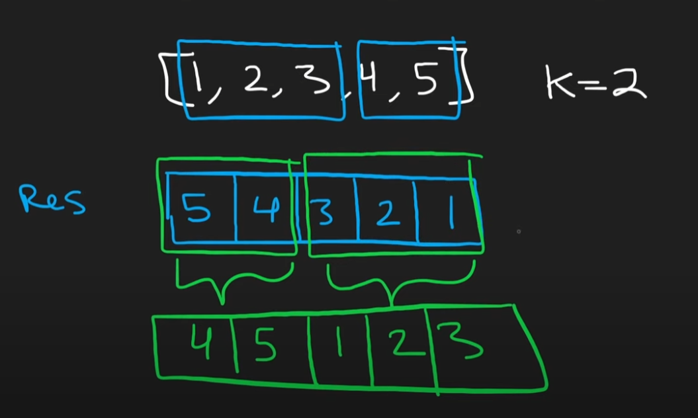

# 189. Rotate Array

- Difficulty: Medium
- Language: C++
- Runtime: 17ms
- Faster than: 82.7% of C++ submissions

#### Problem Description

Given an integer array `nums`, rotate the array to the right by `k` steps, where `k` is non-negative.
